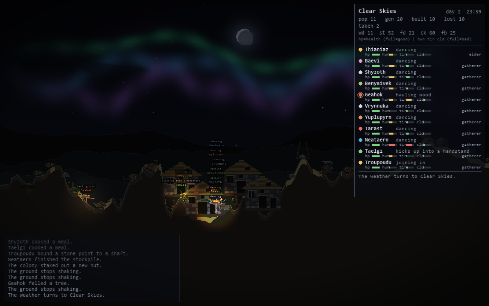
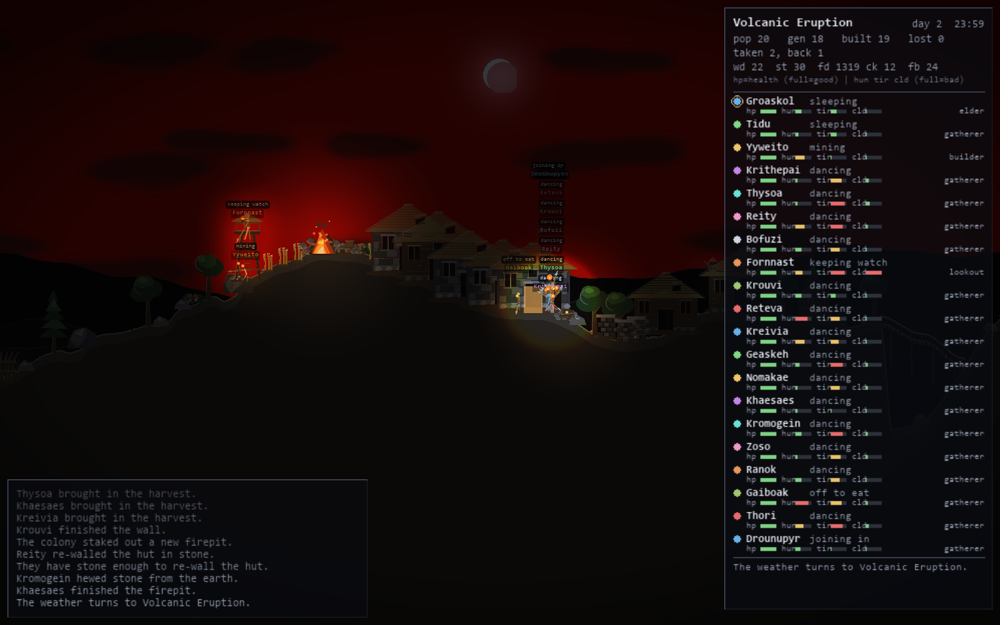
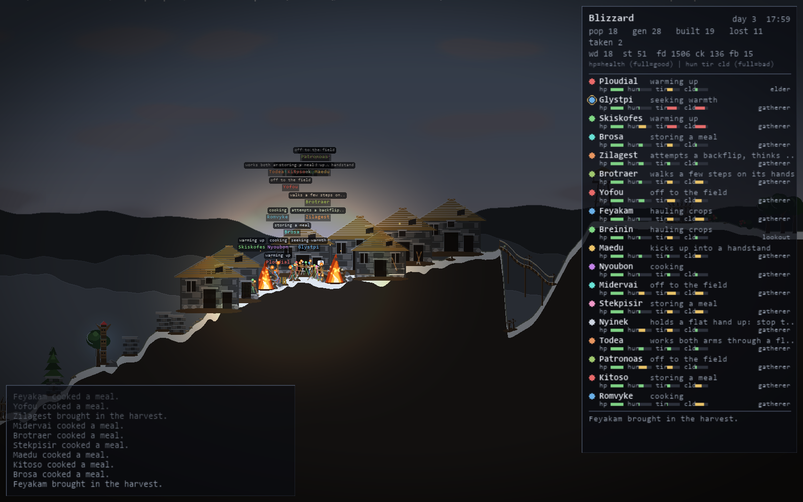

# Backgrounded

A small stickman civilisation that carries on whether or not you're watching.
On Windows it lives in the system tray and paints itself onto your desktop
wallpaper. On Linux there is no wallpaper and no tray — it's simply a window,
and closing the window stops it.

It opens at night, in a storm. The world is almost black. One stickman carries
a candle, and the pool of warm light around them is the only thing you can
reliably see — until lightning cracks and the whole landscape is revealed for a
quarter of a second: every figure frozen mid-stride, the hut they are half way
through building, the tree line on the ridge. Then it's dark again.



They keep going whether or not you're looking. Close the program, come back
tomorrow, and they've still got the hut, the firepit, the names of everyone who
died getting there.

## Running it

**Windows** — double-click **`Backgrounded.bat`**. It checks Python and the
three packages, offers to install them if they're missing, then starts the app
with no console window. It lives in the system tray; the live view window is
shown by default. Running it twice is harmless - the second copy sees the
single-instance mutex and exits.

**Linux** — run **`./backgrounded.sh`** from the project folder. Same idea: it
finds Python, puts the three packages in a virtualenv under
`~/.local/share/Backgrounded/venv` (distro Python is externally managed, so it
will not install into it), and starts the app. It stays in the foreground so
you can see the log; `--detach` gives your prompt back, and `--setup` installs
the packages without launching. There is no tray, so **closing the window ends
the run** — the world is saved on the way out, and so it is on Ctrl+C.

Or, on either platform, from a terminal with the packages already available:

```bash
python run.pyw
```

Useful flags while poking at it (after a `--` if you're going through
`backgrounded.sh`):

```bash
python run.pyw --fresh --scene night_storm --no-wallpaper
```

| Flag | Effect |
|---|---|
| `--fresh` | Ignore the saved world and generate a new one |
| `--scene <name>` | Opening scene (`night_storm`, `wildfire`, `blizzard`, …) |
| `--hide` | Start with the live view hidden (Windows; on Linux it leaves nothing on screen) |
| `--no-wallpaper` | Never touch the desktop wallpaper (Windows; always the case on Linux) |
| `--capture N` | Save N PNG frames to the captures folder |
| `--exit-after N` | Quit after N simulated seconds |

## The menu

Two ways in, offering the same things:

- **In the window** — press **`M`**, or click the gear in the bottom-right
  corner. This is the only menu on Linux, where there's no tray to put one in.
  Escape or a click on the scene closes it.
- **In the tray** — right-click the tray icon. Windows only.

- **Scene** — force a specific scene, and turn off the automatic rotation
- **Speed** — 0.5× up to 16×
- **Window Size** — 50% to 150% of the 1600×1000 render surface
- **Show** — the stats panel, name plates, activity plates, chronicle log
- **Pause**
- **Wallpaper Output** — stop/start writing to the desktop (Windows only)
- **New Landscape** — new terrain and scenery, same people (they keep their
  names, colours and history; buildings don't survive the move)
- **Clear Graves** — sweep the headstones away
- **Save Now**
- **Start Over** — brand new world *and* colony. In the window menu this one
  asks twice, because it's the only entry that destroys a colony you can't get
  back and it sits a few pixels from *Save Now*.
- **Quit** — saves on the way out, and restores your original wallpaper

Only the tray offers **Show Window**: a button inside the window that hides the
window is a trap when there's no icon left to bring it back.

## Reading the stats panel

Top-right. Colony summary first — scene, day, clock, population, generation,
structures built, losses — then the stockpile (`wd` wood, `st` stone, `fd`
food, `ck` cooked, `fb` fibre), then one row per stickman.

Each row is their identity colour, name, what they're doing right now, and
three need bars. **A full bar is bad:**

| Bar | Meaning |
|---|---|
| `hun` | hungry — they'll go and eat |
| `tir` | tired — they'll find a hut and sleep |
| `cld` | cold — they'll huddle at the fire |

A ring around the colour dot marks whoever is carrying the candle. The bottom
line is the most recent entry in the chronicle.



A colony at its cap of twenty, mid-upgrade: some huts still timber, some
already rebuilt in stone. Losses in the chronicle are red, arrivals green.

## Your wallpaper

Windows only. Setting a desktop background is a different command on every
Linux desktop and impossible on most Wayland compositors, so there the picture
lives in the window and your desktop is never touched — nothing is read, backed
up or restored.

The program records your current wallpaper at startup and puts it back when it
exits. If it's ever killed hard enough to skip that (Task Manager, power loss),
just set your wallpaper again normally.

Note that **only one program can own the desktop wallpaper.** If you run
something else that rotates wallpapers, the two will fight and you'll see
flicker. Turn the other one off, or use **Wallpaper Output** to leave your
desktop alone and just watch the live view.

## What's in there

50 implemented features, listed in
[docs/ARCHITECTURE.md](docs/ARCHITECTURE.md#7-the-50-features) — stickmen
gather wood and stone, haul it to a stockpile, and build a firepit, huts, a
wall, a bridge, a watchtower and eventually a totem. They eat, sleep, get cold,
huddle at the fire, talk to each other, celebrate finished buildings, and mourn
at gravestones.



Stay content for long enough and the huts come back up in stone — the first
tech tier, and one the colony has to earn rather than research.

They also die: falls from cliffs, lightning strikes, wildfires, mudslides,
floods, drowning, meteor strikes, and — if the colony truly runs out — hunger
and cold. When one dies a grave is placed, the others mourn, and a new stickman
arrives with a new name and colour, one generation later. Only the ten most
recent headstones stay standing; older ones weather away, so a world left
running overnight doesn't turn into a cemetery. The running history is kept in
`chronicle.txt` next to the save file.

## Wildlife and other visitors

Wolves, bears and boars wander in from the edge of the world every few minutes.
An unarmed stickman runs. An armed one turns and fights.

That's the loop: the first pack is genuinely dangerous, because nobody has a
spear yet and nobody has leather — and leather is made from hides, which you
only get by killing something. So the colony arms itself out of whatever tried
to eat it. A spear costs wood and stone; armour costs hides and fibre and
absorbs about half of everything after that.

Wounded animals break off and run, but bleeding slows them down, so a hunter
can run one down instead of watching it escape at full speed.

And occasionally, usually at night, something else turns up. A saucer drifts
in, hangs over somebody, and takes them up in a beam of light. That isn't a
death: there's no body and no gravestone. Sometimes, much later, it brings them
back — same name, same colour, thoroughly rattled.

## Where it keeps things

`%LOCALAPPDATA%\Backgrounded\` on Windows, `~/.local/share/Backgrounded/`
(i.e. `$XDG_DATA_HOME`) on Linux.

| File | Contents |
|---|---|
| `save.json` | The world — terrain, people, buildings, history |
| `config.json` | Your settings |
| `chronicle.txt` | Readable log of everything notable that happened |
| `backgrounded.log` | Diagnostics |
| `instance.lock` | Held open so a second copy knows to stand down (Linux) |
| `wallpaper_a.bmp` / `_b.bmp` | Alternating wallpaper output (Windows, and in `~/Pictures/Backgrounded` — the shell refuses to load a wallpaper out of `%LOCALAPPDATA%`) |

## Requirements

Python 3.11+ on Windows or Linux, plus:

```bash
pip install pygame-ce pillow numpy
```

No `pywin32` and no `pystray` — the tray icon and wallpaper handling are done
directly through `ctypes`, and both are skipped entirely off Windows. There is
no extra dependency for the Linux build; it is the same three packages and the
same code, with `backgrounded/host.py` deciding which parts of the desktop
shell exist.

## Development

`docs/ARCHITECTURE.md` is the design contract: thread model, module boundaries,
data shapes, render layer order, and the reasoning behind the light composite.
Worth reading before changing anything in `render/` or `shell/`.

Two rules keep the codebase honest:

- **Nothing in `sim/` may import pygame.** The simulation runs headless, which
  is how it gets tested.
- **Nothing in `render/` may mutate sim state.** Rendering reads only.
